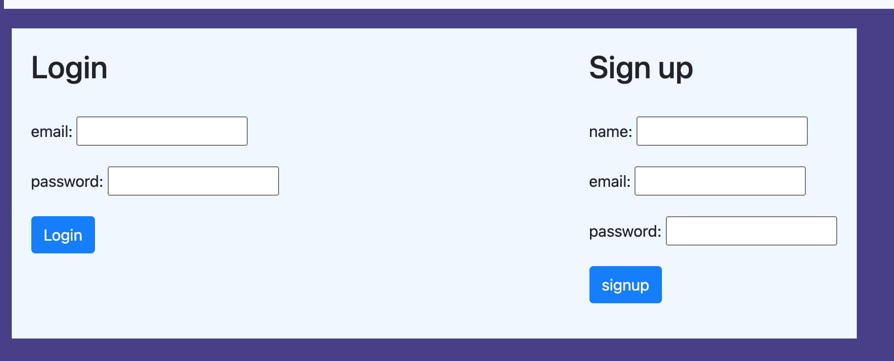
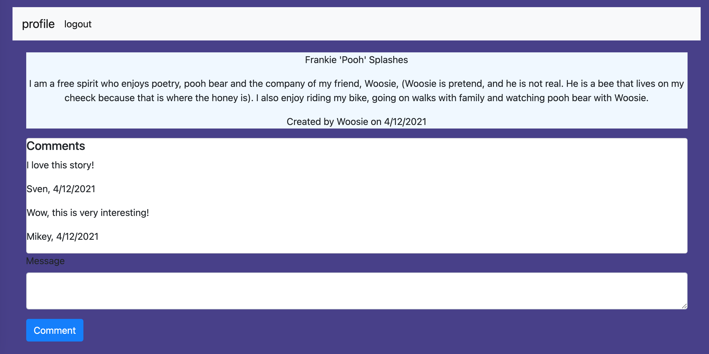
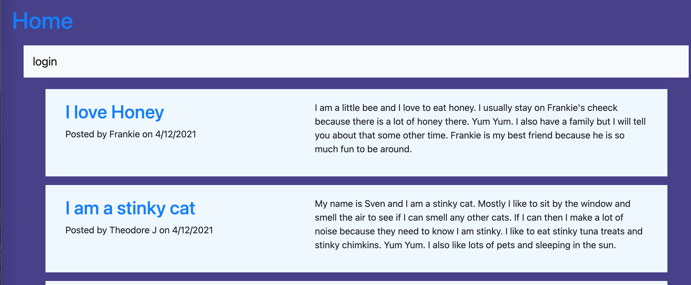

# vigilante-octo-spruce

## overview
This app is a blog where users can create an account, login from anywhere and post a blog post, write a responding comment to a post, or delete any post they have created. All blog posts are displayed for anyone to view.

## useage
To start it is best if a user profile is created. By clicking on the login link a user can create a new profile or login with an existing profile. User passwords are stored securely and are hashed before stored in a database. Once logged in the user will be able to view their profile page.

On the profile page a user is able to create a new blog post by writing a title and a message and then clicking "create." This page also displays all blog posts that the logged in user has created. This is also where a user can delete any blog post that they have created.

When a user is on the home page, they can view all blog posts created by the other useres. When a blog post is clicked on, the message and following comments are displayed. This is also where a user can create a comment to the blog post. Both the blog post and the comments are time stamped upon creation.

The user will stay logged in while using the same browser until they have clicked the logout button on the profile page.

## technologies
Database: Created using sequlize NPM package and stored in JawsDB MySql through Heroku.

Security: Bcrypt, an NPM package, was used to hash passwords so that user passwords are stored securely.

Routes: Created using express, an NPM package and written using node.js.

Views: Written with handlebars, an NPM package that templates and renders dynamic html.

Deployment: Heroku.

## development
At the moment, this application is still in development. The styling is basic and is incomplete and the comments cannot yet be deleted. User profile information and blog posts cannot be updated yet either.

## URL and github

[The Blog](https://vigilante-octo-spruce.herokuapp.com/)

[Employee Database Github Repo](https://github.com/MikeyP957/vigilante-octo-spruce)